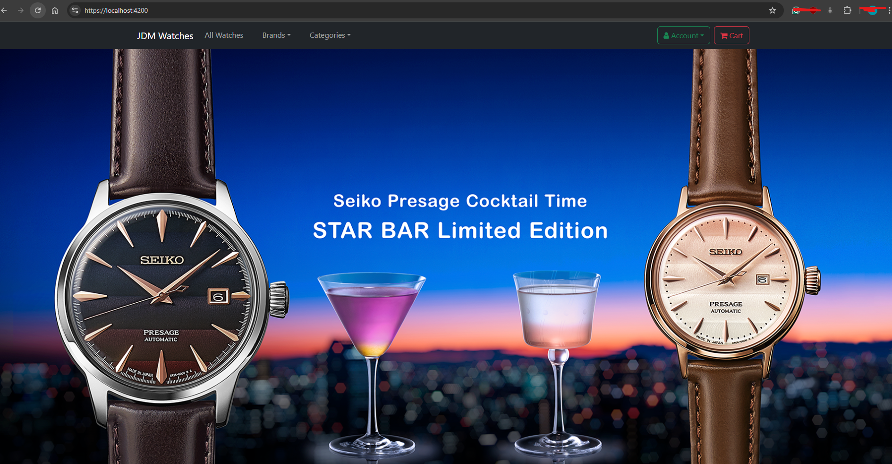

# Full Stack C# with Angular E-commerce Application

**Note:** Development on this project is currently paused as I’ve shifted focus to new projects.

Technologies used:
- Built a web application using ASP.NET Core, Entity Framework Core and Angular
- Upgraded to .net 8
- Angular 16
- Docker compose setup with Postgres DB
- Implement Authentication using JWT Authentication tokens
- Used Automapper in ASP.NET Core and ngx-bootstrap

Features to date:
- User sign-up and sign-in pages
- Identity role management for authorisation
- Cart system and order system
- Users and non-users can add products to the cart and order them
- Implement filtering, sorting and paging of data
- Angular Template forms, Reactive forms and validation
- Guard system to stop non-users from accessing user account pages and the admin pages
- Added routing to the Angular application and secured routes
- JWT token needed for Users to edit account details and retrieve their order history
- Authorisation in the backend to prevent anyone from accessing customer data that does not belong to them
- Display notifications and loading spinners in Angular 

Feature missing:
- Admin Page to update orders and add new products
- Payment system integration

